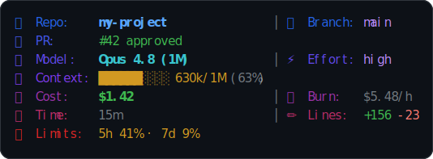
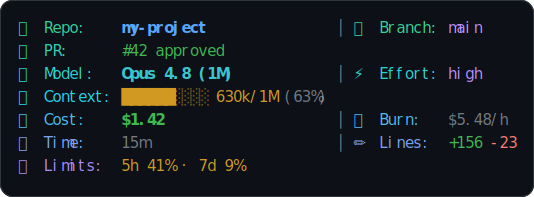
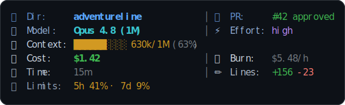
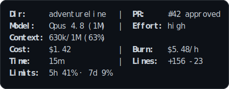

# adventureline

A themeable, aligned, multi-line **statusline for [Claude Code](https://claude.com/claude-code)** — key/value columns that line up like a table, with a gradient label style inspired by Gemini CLI. Four built-in themes, switchable with one command.



## Themes

Switch with `adventureline theme <name>`, the `ADVENTURELINE_THEME` env var, or just ask Claude to change it.

**Adventure** — brand gradient, blue → red.


**Aurora** — northern-lights gradient, green → cyan → violet.


**Star Command** — sober navy → white → grey (sky & stars).


**Minimal** — no emoji, no colors, no load bar. Bold labels, normal values.


## What it shows

Grouped in three rows (Local/VCS · Engine · Session), only items with data appear:

| Item | Meaning |
|------|---------|
| 📁 Repo / Dir | git repo name, or folder when not in a repo |
| 🌿 Branch | current branch + `*N` dirty file count |
| 🔃 Sync | commits ahead/behind upstream (`⇡`/`⇣`) |
| 📂 Path | path inside the repo |
| 🔀 PR | open PR number + review state |
| 🌲 Worktree · 🏷️ Session · 🕵️ Agent | when present |
| 🤖 Model · ⚡ Effort | model name, reasoning effort (when ≠ medium) |
| 🧠 Context | load bar + tokens used / limit + **% used** |
| 💰 Cost · 🔥 Burn | session cost $ and $/hour burn rate |
| ⏱️ Time · ✏️ Lines | session duration, lines added/removed |
| ⏳ Limits | 5h / 7d subscription rate-limit % (+ reset ETA) |

The layout adapts to terminal width (2 columns by default, 3 when ≥110 cols) and aligns every value to a shared column by measuring **visible** width (emoji count as 2, ANSI as 0).

## Install

```bash
git clone https://github.com/adventurelabsbrasil/adventureline.git
cd adventureline
./install.sh            # copies into ~/.claude/adventureline and prints the settings snippet
```

Then add to `~/.claude/settings.json`:

```json
{
  "statusLine": {
    "type": "command",
    "command": "~/.claude/adventureline/statusline.sh"
  }
}
```

Restart Claude Code. **Requires:** `bash`, `jq`, `python3`, `git`.

## Switching themes

```bash
adventureline theme aurora      # set the active theme (persists in theme.conf)
adventureline list              # list themes + current
adventureline preview           # render a sample of every theme
```

Or pin a theme directly in `settings.json` (no state file):

```json
{ "statusLine": { "type": "command", "command": "ADVENTURELINE_THEME=starcommand ~/.claude/adventureline/statusline.sh" } }
```

Or just tell Claude Code: *"switch adventureline to the minimal theme."*

## Customize the gradient

Any color theme reads two env vars (`"r,g,b"`, multi-stop with `;`):

```bash
ADVENTURELINE_THEME=adventure \
AL_GRAD="255,0,128;128,0,255" \
~/.claude/adventureline/statusline.sh
```

## How it works

- `statusline.sh` — reads the Claude Code statusline JSON from stdin (one `jq` pass), builds themed `emoji␟label␟value` cells.
- `statusline-grid.py` — measures visible width, aligns key/value columns, applies the label gradient, and prints the grid. Falls back to a plain single-line-per-group layout if `python3` is unavailable.

## License

MIT © 2026 Adventure Labs.
